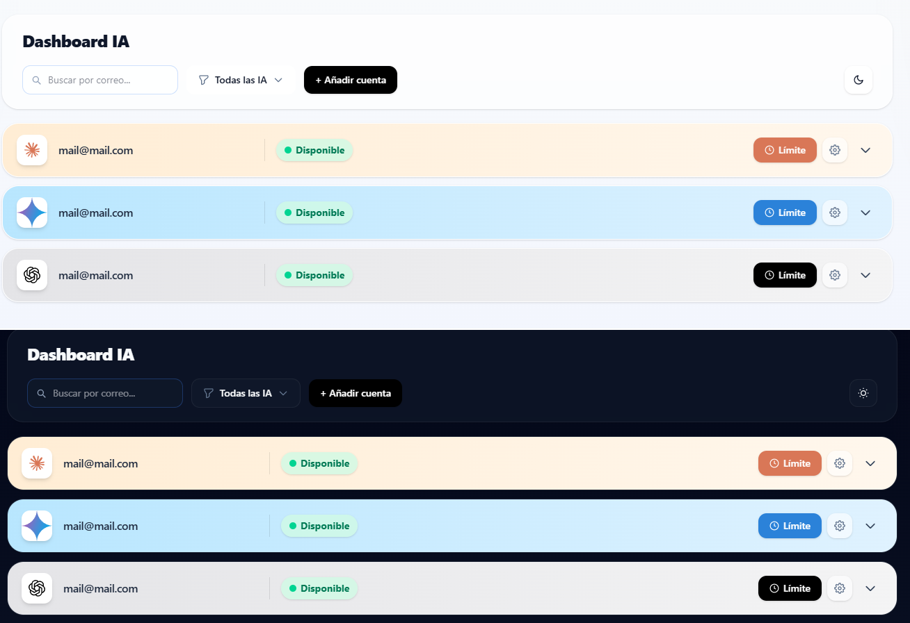
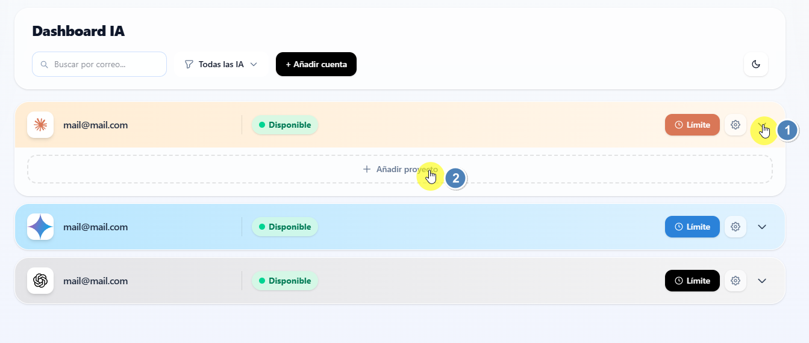
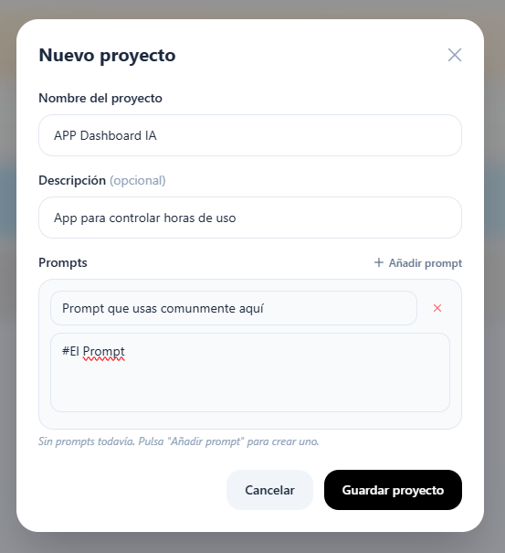
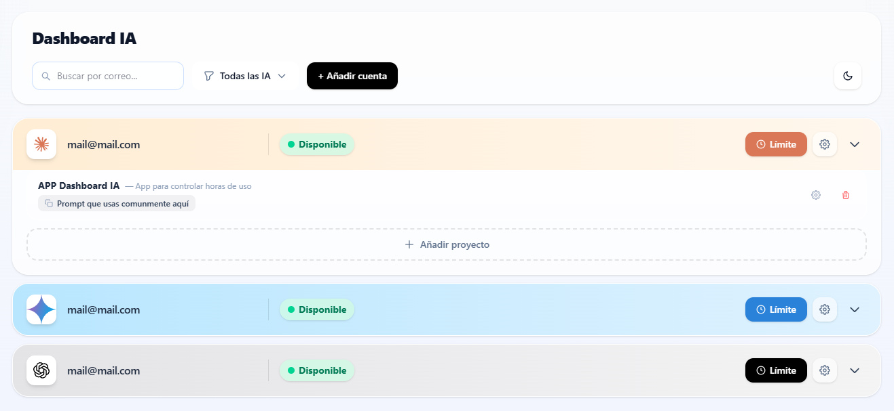

# Dashboard IA

A local dashboard to manage your AI accounts — track usage limits, organize projects and copy prompts in one click. No cloud, no subscriptions, runs entirely on your machine.

> También disponible en español más abajo.
---
### Screenshots

**Vista general**


**Proyectos y prompts**



**Vista desplegada con proyecto**

Esto te permite tener los prompts que utilizas y con solo pulsar encima se copia en tu portapapeles. 
---

## 🇬🇧 English

### What is this?

A clean, minimal dashboard to keep track of your AI accounts (Claude, ChatGPT, Gemini and more). You can set reset times for limited accounts, organize projects per account, and store prompts that you can copy to clipboard instantly.

### Files

| File | Description |
|------|-------------|
| `index.html` | The web app |
| `server.js` | Local server (don't touch) |
| `accounts.example.json` | Rename to `accounts.json` — your accounts are stored here |
| `projects.example.json` | Rename to `projects.json` — your projects and prompts are stored here |
| `Abrir Dashboard.bat` | Double-click to launch (Windows) |

### Requirements

- Windows
- [Node.js LTS](https://nodejs.org) — free, one-time install

### First time setup

1. Install Node.js from [nodejs.org](https://nodejs.org) (LTS version)
2. Download or clone this repository into a folder, e.g. `C:\Users\YourName\Dashboard IA\`
3. Rename `accounts.example.json` to `accounts.json`
4. Rename `projects.example.json` to `projects.json`
5. Double-click `Abrir Dashboard.bat`
   - A black terminal window opens (the local server)
   - Your browser opens automatically at `http://localhost:3000`
6. Done — add your accounts and start using it

### Daily use

Just double-click `Abrir Dashboard.bat`. Keep the black window open while using the dashboard — closing it stops the server.

### Editing accounts manually

Open `accounts.json` with Notepad or VS Code:

```json
[
  {
    "id": "...",
    "provider": "claude",
    "email": "you@example.com",
    "limitReset": null,
    "tags": ["work"],
    "expanded": false
  }
]
```

Supported providers: `claude`, `chatgpt`, `gemini`. The order in the JSON is the order shown in the dashboard.

### Backup / moving to another computer

Copy the entire folder. That's it — `accounts.json` and `projects.json` contain everything.

### Desktop shortcut

1. Right-click `Abrir Dashboard.bat`
2. "Send to" → "Desktop (create shortcut)"
3. Optional: right-click the shortcut → Properties → Change icon

---

## 🇪🇸 Español

### ¿Qué es esto?

Un dashboard limpio y minimalista para gestionar tus cuentas de IA (Claude, ChatGPT, Gemini y más). Puedes configurar la hora a la que se desbloquea una cuenta limitada, organizar proyectos por cuenta y guardar prompts que puedes copiar al portapapeles con un solo clic.

### Archivos

| Archivo | Descripción |
|---------|-------------|
| `index.html` | La aplicación web |
| `server.js` | El servidor local (no tocar) |
| `accounts.example.json` | Renómbralo a `accounts.json` — aquí se guardan tus cuentas |
| `projects.example.json` | Renómbralo a `projects.json` — aquí se guardan tus proyectos y prompts |
| `Abrir Dashboard.bat` | Doble clic para arrancar |

### Requisitos

- Windows
- [Node.js LTS](https://nodejs.org) — gratuito, instalación única

### Primer uso

1. Instala Node.js desde [nodejs.org](https://nodejs.org) (versión LTS)
2. Descarga o clona este repositorio en una carpeta, por ejemplo `C:\Users\TuNombre\Dashboard IA\`
3. Renombra `accounts.example.json` a `accounts.json`
4. Renombra `projects.example.json` a `projects.json`
5. Doble clic en `Abrir Dashboard.bat`
   - Se abre una ventana negra (el servidor local)
   - Se abre el navegador automáticamente en `http://localhost:3000`
6. ¡Listo! Añade tus cuentas y empieza a usarlo

### Uso diario

Doble clic en `Abrir Dashboard.bat`. Mantén la ventana negra abierta mientras usas el dashboard — al cerrarla se para el servidor.

### Editar cuentas a mano

Abre `accounts.json` con el Bloc de notas o VS Code:

```json
[
  {
    "id": "...",
    "provider": "claude",
    "email": "tu@correo.com",
    "limitReset": null,
    "tags": ["trabajo"],
    "expanded": false
  }
]
```

Proveedores disponibles: `claude`, `chatgpt`, `gemini`. El orden en el JSON es el orden que aparece en el dashboard.

### Backup / mover a otro ordenador

Copia toda la carpeta. Con eso es suficiente — `accounts.json` y `projects.json` contienen todo.

### Acceso directo en el escritorio

1. Clic derecho en `Abrir Dashboard.bat`
2. "Enviar a" → "Escritorio (crear acceso directo)"
3. Opcional: clic derecho en el acceso directo → Propiedades → Cambiar icono

---

## License

MIT — free to use, modify and share. Credits appreciated but not required.
